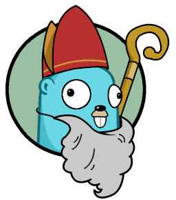

# go-surprise

The goal of this project is the provide a backend application that will help
manage the people participating in the Dutch tradition surprise (sur-preeze).

Don't have a hat to draw names from? Don't want to accidently lose the name of the person your suppose to give a gift to? Then no worries, let go-surprise do it for you!

This project uses Go and AWS Lambda.

## What is Surprise (sur-preeze)

The Dutch tradition Surprise is nearly identical to the tradition "Secret Santa" but with the gifts wrapped in original and funny ways and usually accompanied with a poem. It is traditional celebrated on the evening before Sinterklaas's birthday on December 5th, that is why the Go Gopher is dressed the way he is!

## Build requirements

To build `go-surprise` you need:

* AWS Account
* [aws cli](https://aws.amazon.com/cli/)
* [Go](https://golang.org/dl/)

## Getting started

1. Setup aws cli with `aws configure`
2. Deploy lambda with `make deploy`
